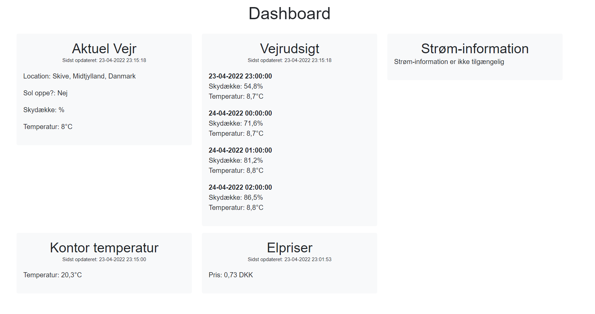
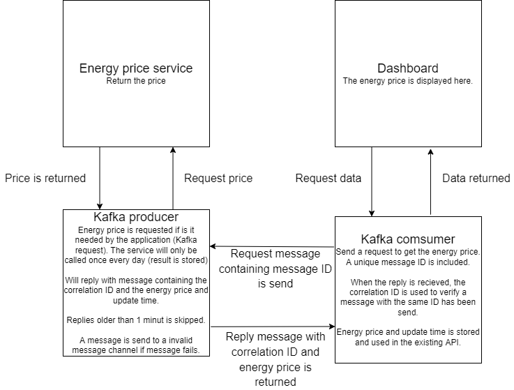
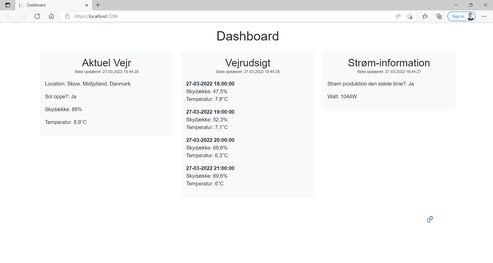

# Case del 6 - Dashboard fortsat

Billede af kørende applikation:

Diagram over integration af energi pris og Kafka

API user secrets:
{
  "Weather:ApiKey": "xxx",
  "ftp": {
    "Username": "xxx",
    "Password": "xxx"
  },
  "DbConnectionString": "xxx"
}

Energy price is running in seperate application: https://github.com/steffen2811/Kafka_energy_price
To Run: Follow instructions in "Kafka_energy_price", and start API and blazor (remember user secrets).

# Energy price using Kafka request-reply pattern.

<b>Steps to run:</b>

Run "Docker-compose up -d". This will start zookeeper, kafka and create topics.

Open Kafka_producer_energy_price.sln and run application.

<b>Info:</b>

Application will wait for request and return the price to the topic specified in the header. 

Correlation ID is also included to match the message ID from the request.

# Case del 4 - Dashboard

Billede af kørende applikation:

API og Blazor server appen startes simpelt ved at åbne .sln filerne og derefter starte dem i visual studio.